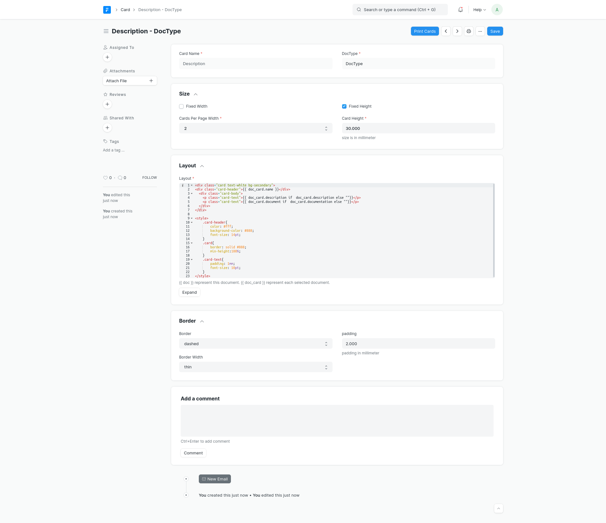
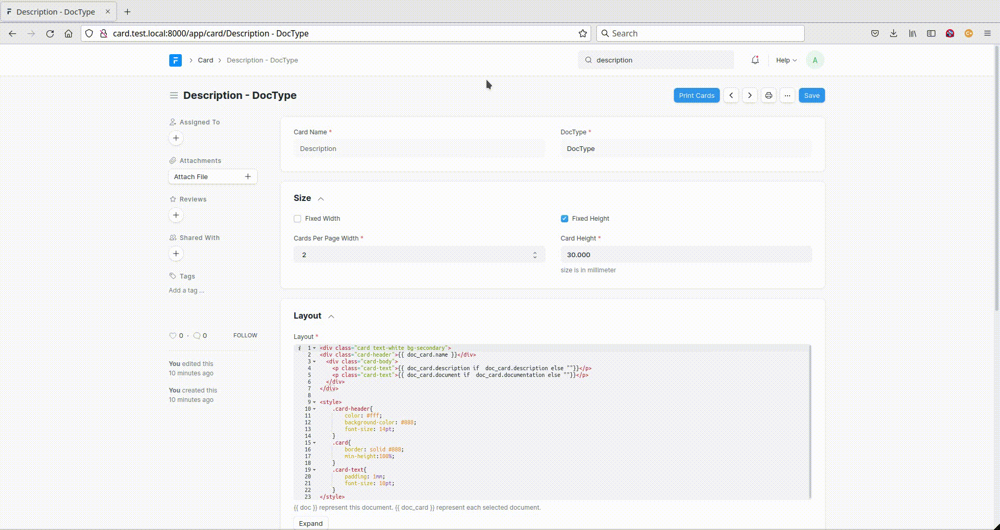

# Card

Print multiple documents in one page.
<!-- TOC depthFrom:2 depthTo:4 withLinks:1 updateOnSave:1 orderedList:0 updateOnSave:1 -->

- [Installation.](#installation)
  - [1. Dependencies](#1-dependencies)
  - [2. Installation.](#2-installation)
- [Use](#use)
  - [1. Create Card.](#1-create-card)
  - [2. Print Cards.](#2-print-cards)
  - [3. Permissions.](#3-permissions)
  - [4. Example:](#4-example)
- [License](#license)

<!-- /TOC -->

**Card** is an application built on **frappe** framework.

## Installation.
#### 1. Dependencies
1. frappe-bench
2. frappe.

#### 2. Installation.

  ```sh
  bench get-app https://github.com/amadhaji/card.git
  ```

  ```sh
  bench --site <site_name> install-app card
  ```


## Use
To access the card list, go to:

> Home > Tools > Printing > Card

#### 1. Create Card.
When Create new Card.
1. Enter a **Name** for the Card **_(set only once)_**.
2. Select the **doctype** which documents will be of its type **_(set only once)_**.
3. Check **Fixed Width** if each card has a fixed width, **uncheck** it if prefer to enter number of cards per page width.
4. Enter **Card Width** in millimetre if Fixed Width checked, or Select number of **Cards Per Page Width** if it's unchecked.
5. Check **Fixed Height** if each card has a fixed height, **uncheck** it if  prefer to be Content Height.
6. Enter **Card Height** in millimetre if Fixed Height checked.
7. Enter **Layout** of each card, It's Jinja template and can use **_`{{ doc }}`_** which represent the card document itself, and **_`{{ doc_card }}`_** which represent each selected document.
  * **_e.x_**: `{{ doc.card_name }}` , `{{ doc.layout }}` , `{{ doc_card.<any_field_of_selected_doctype> }}`.
8. Select **Border** type for card, It's aimed to be out of card and used as marker for cutting.
9. Select **Border Width**.

10. Enter **Padding** in millimetre between card border and Content.


#### 2. Print Cards.
After Saving the document **Print Cards** button will be shown, clicking it will show MultiSelectDialog, found in it
1. default filters, they are **In List View / In Standard Filter** doctype fields.
2. Addition Filters.

3. table for selecting documents **_(20 at most)_**.
4. **Select All** Check Box to select all documents meet your filters.
5. **print** button.

Click **Print** in the dialog to go to Print View, and be sure to select **Card** As the **Print Format**.

#### 3. Permissions.
* **System Manager** Has All access.
* **Print User** able to read and print **_(Print Cards)_**.


#### 4. Example:
Printing DocType Description.
> Document JSON.
>```json
{"card_name":"Description","doctype_card":"DocType","fixed_width":0,"card_width":0,"cards_per_page_width":"2","fixed_height":1,"card_height":30,"layout":"<div class=\"card text-white bg-secondary\">\n<div class=\"card-header\">{{ doc_card.name }}</div>\n  <div class=\"card-body\">\n    <p class=\"card-text\">{{ doc_card.description if  doc_card.description else \"\"}}</p>\n    <p class=\"card-text\">{{ doc_card.document if  doc_card.documentation else \"\"}}</p>\n  </div>\n</div>\n\n<style>\n    .card-header{\n        color: #fff;\n        background-color: #888;\n        font-size: 14pt;\n    }\n    .card{\n        border: solid #888;\n        min-height:100%;\n    }\n    .card-text{\n        padding: 1mm;\n        font-size: 10pt;\n    }\n</style>","border":"dashed","padding":2,"border_width":"thin","doctype":"Card"}
```
> **_hint:_**
> Copy the **JSON** text and paste it anywhere in browser while browsing frappe.
> to create **new doc** from the **JSON**.
>

<br/><br/>



**************************



## License

GPLv3+
